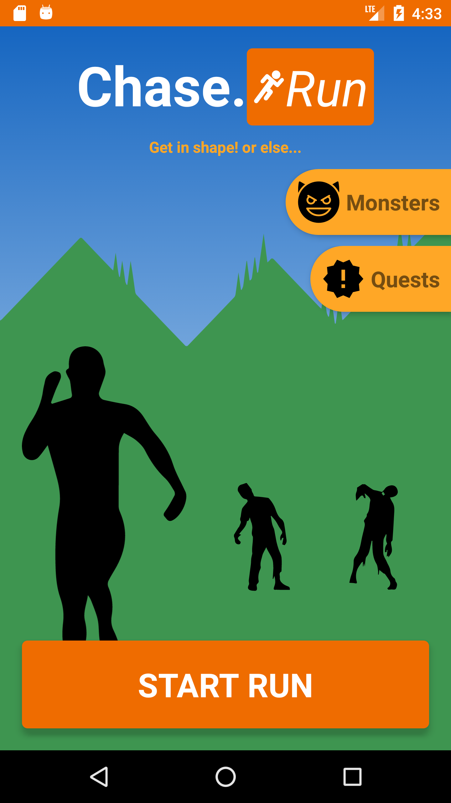
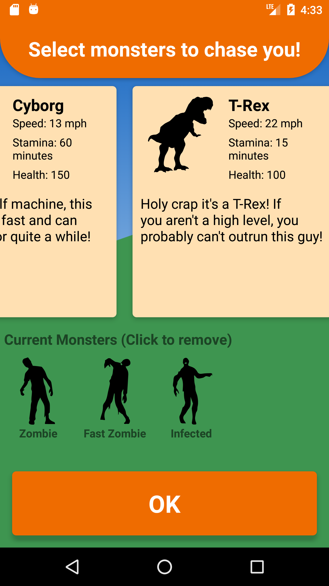
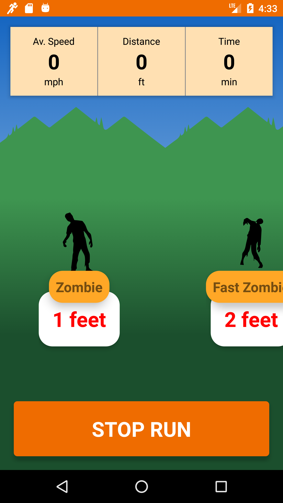

## Now availabe in the Playstore!

https://play.google.com/store/apps/details?id=run.quest.twang.questrun

## Chase.Run!

This app is a run tracker app with a twist. Before you start a run, you can set a monster to chase you.

## Program Structure

This app uses
- Async threading within a service to track a user's run and the monsters that are chasing you
- Object oriented programming using abstract classes to manage all the different quest types
- Database to save quest information
- System's media player to inform users when a monster is getting close
- Step sensor to track a player's movement

## App Features

- Users can use this app to track their run, how far they've run and how long they've been running
- The App will give users random "quests" to do, such as "run for 15 minutes" or "outrun a zombie".
- User can level up when they finish quests and increase their in game speed
- User can pick their own monsters to run against
- User can hear monsters making noise when they are close

## Screens

   

## Future plans

- Add a database to keep a record for each run
- Using firebase, the app will sync to the cloud and allow users to save their progress and their run records
- A weapon system where that users can activate by sprinting
- GPS based tracking instead of step based
- More modes will be added to the game, such as "kill quests" where users can kill a monster that is chasing them and "catch quests" that allows users to chase down monsters
- A store that allows users to by items and weapons using in game coins
- More monsters for users to run with

## Known issues

- The game's audio is sometimes not loud enough to be heard through music
